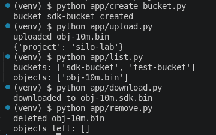
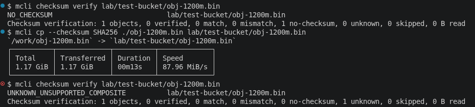

# Basic S3
## Goal
To test MinIO basic cli as a S3 and make sure it's working before start anything. 

## Environment
- Images : [Silo and NGINX as Load Balancer](./evidence/compose-ps.txt)
- Docker and Docker Compose versions : [Docker and Docker Compose Versions](../01-build-cluster/evidence/docker-versions.txt)
- OS : [Nix and NixOS Version](../01-build-cluster/evidence/nix-version.txt)
- Topology :
    - Profile C (more small machines, 4GB RAM and 8GB Swap): 4 nodes x 1 drive [Topology](../01-build-cluster/evidence/free-h.txt)
- Date : 10 Oct 2026

## Steps
### Create Third MCLI Service as Client (Using Docker)
You may test it in silo services but it will be treated as a root. It would be better if we use sepparate service as its client. If you don't have `mcli`, you can use this command bellow

```bash
. .env
mcli() {
docker run --rm -i --network silo-cluster_lab \
    -v "$HOME/.mcli-lab:/cfg" \
    -v "$PWD:/work" -w /work \
    --entrypoint mcli "$SILO_IMAGE" --config-dir /cfg "$@"
}
```

### Create File
- Command:
```bash
    head -c 1200M /dev/urandom > objects/obj-1200m.bin
    sha256sum objects/obj-1200m.bin | tee evidence/checksum-before.txt
```
- Expected: files are created and the hashes are recorded.
- Actual: [evidence/checksum-before.txt](./evidence/checksum-before.txt)
- Result: PASS

> **NOTE** : You may use other method like real file but we can just use it for simple test

### Create Bucket
- Command: 
```bash
    mcli mb lab/test-bucket
```
- Expected: `Bucket created successfully`
- Actual: [evidence/create-bucket.txt](./evidence/create-bucket.txt)
- Result: PASS

### Upload Object to Bucket
#### Multi-part upload (1GB)
- Command: 
```bash
    mcli cp ./objects/obj-1200m.bin lab/test-bucket/obj-1200m.bin
```
- Expected: 1.17 GiB transferred, no OOM-kill on any node.
- Actual: 1.17 GiB in 00m13s (87.96 MiB/s). [evidence/cp-upload.txt](./evidence/cp-upload.txt)
- Result: PASS

#### Presigned URL
- Command:
```bash
    URL=$(mcli share download --expire 10m lab/test-bucket/obj-10m.bin | grep '^Share:' | awk '{print $2}')
    curl -sS -o /tmp/presigned.bin -w "HTTP %{http_code}\n" --connect-to lb:9000:127.0.0.1:9000 "$URL"
    sha256sum /tmp/presigned.bin
```
- Expected: `HTTP 200`
- Actual: [evidence/presigned-curl.txt](./evidence/presigned-curl.txt), [evidence/presigned-checksum-after.txt](./evidence/presigned-checksum-after.txt)
- Result: PASS 
- Note: the URL is never stored (`X-Amz-Credential=<REDACTED>`, `X-Amz-Signature=<REDACTED>`).

#### Custom metadata and tags
- Command:
```bash
    mcli cp --attr "project=silo-lab;owner=intern" ./objects/obj-10m.bin lab/test-bucket/obj-10m-custom.bin
    mcli stat lab/test-bucket/obj-10m-custom.bin
    mcli tag set lab/test-bucket/obj-10m-custom.bin "env=lab&tier=test"
    mcli tag list lab/test-bucket/obj-10m-custom.bin
```
- Expected: `stat` shows `X-Amz-Meta-Project` and `X-Amz-Meta-Owner` after using `tag list`
- Actual: [evidence/obj-custom-stat.txt](./evidence/obj-custom-stat.txt), [evidence/obj-tags.txt](./evidence/obj-tags.txt)
- Result: PASS

### List Buckets and Objects
- Command: 
```bash 
    mcli ls lab 
    mcli ls lab/test-bucket
```
- Expected: `test-bucket` and the uploaded objects are listed.
- Actual: [evidence/ls-buckets.txt](./evidence/ls-buckets.txt), [evidence/ls-objects.txt](./evidence/ls-objects.txt)
- Result: PASS

### Download Object from Bucket
- Command:
```bash
  mcli cp lab/test-bucket/obj-1200m.bin ./objects/obj-1200m.download.bin
  sha256sum objects/obj-1200m.download.bin | tee evidence/checksum-after.txt
  { [ "$(cut -d' ' -f1 evidence/checksum-before.txt)" = "$(cut -d' ' -f1 evidence/checksum-after.txt)" ] && echo MATCH || echo MISMATCH; } | tee evidence/checksum-compare.txt
```
- Expected: `MATCH`
- Actual: [evidence/cp-download.txt](./evidence/cp-download.txt), [evidence/checksum-compare.txt](./evidence/checksum-compare.txt) (MATCH)
- Result: PASS

### Verify Checksum (mcli checksum verify)
- Command: 
```bash
    mcli checksum verify lab/test-bucket/<object>
```
- Expected: `1 verified, 1 match, 0 mismatch`
- Actual:
  - Uploaded without checksum: `NO_CHECKSUM` (0 verified)
  - 1.2 GB object with `--checksum SHA256`: `UNKNOWN_UNSUPPORTED_COMPOSITE` (0 verified)
  - 
- Result: FAIL for the first time, PASS after that. See [Findings](#findings).

### Delete Object from Bucket
- Command: 
```bash
mcli rm lab/test-bucket/obj-10m.bin
mcli ls lab/test-bucket
```
- Expected: the object is removed and the listing is empty.
- Actual: `evidence/rm.txt`
- Result: PASS

### Using SDK (Boto3)
Scripts are in `/app`, split by operation.

#### Before Start
1. Start the cluster: `docker compose up -d` and wait until all services are healthy.
2. Copy `.env.example` to `.env` and fill in the credentials (never commit `.env`).
3. Create a venv and install dependencies: `python -m venv venv && source venv/bin/activate && pip install -r requirements.txt`
4. Run every script from the repo root, in the order below.

#### Create Bucket
- File: `app/create_bucket.py`
- Command: `python app/create_bucket.py`
- Expected: prints that `sdk-bucket` was created (or "already exists" on rerun).

> **NOTE** : IT SHOULD BE RUN FIRST IF YOU WANNA TRY ALL OF SDK STEPS

#### Upload Object
- File: `app/upload.py`
- Command: `python app/upload.py`
- Expected: upload succeeds and prints the metadata `{'project': 'silo-lab'}`.

> **NOTE** : IT SHOULD BE RUN FIRST IF YOU WANNA TRY REMOVE AND DOWNLOAD SDK STEPS

#### List of Buckets and Objects
- File: `app/list.py`
- Command: `python app/list.py`
- Expected: prints `sdk-bucket` and the key `obj-10m.bin`.

#### Download Object
- File: `app/download.py`
- Command: `python app/download.py` then `sha256sum objects/obj-10m.bin objects/obj-10m.sdk.bin`
- Expected: `objects/obj-10m.sdk.bin` is created and both hashes are identical.

#### Remove Object
- File: `app/remove.py`
- Command: `python app/remove.py`
- Expected: object deleted, and the listing shows no objects.


Result for each SDK step: PASS, evidence: 



## Findings
- `mcli checksum verify`: objek without checksum -> NO_CHECKSUM (0 verified).
- Upload multipart with `--checksum SHA256` after the object was there-> `UNKNOWN_UNSUPPORTED_COMPOSITE`.



- Presigned URL load host `lb:9000`, so you have to use `--connect-to`.
- Result 4 GB RAM: no OOM-kill when upload 1.2 GB but it's using dummy.

## How to reproduce and clean up
Same as [Past Configuration](../02-healthcheck/readme.md#how-to-reproduce-and-clean-up)